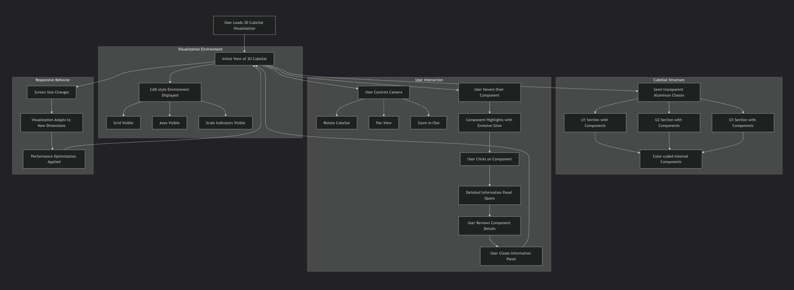

# 🧠 Prompt: “Three.js 3U CubeSat CAD Visualization (Detailed Block Diagram)”

The task involves creating a detailed 3D CAD visualization of a 3U CubeSat system using Three.js. The CubeSat, with dimensions of 10 cm in width and height and 34 cm in length, is to be subdivided into three sections (U1, U2, and U3). Each unit will be represented as a semi-transparent structure featuring an aluminum-like material with an opacity range of 0.25 to 0.35. Internal separator plates will demarcate the units, and various color-coded internal components, such as experiment payloads, sensors, and electronics, will be accurately positioned and labeled within each section.

The visualization will incorporate ambient and directional lighting to enhance depth, with features such as orbit controls for navigation and a comprehensive labeling system for user interaction. Each internal block will highlight when hovered or clicked, with a soft white emissive glow effect. Additionally, the environment will include a grid and axes for orientation, enabling users to gauge scale effectively. The final output is expected to be a fully functional, interactive scene that works seamlessly in modern browsers, with potential enhancements like toggling visibility for each section, animations, and info panels detailing module specifications.

---

**Instructions:**

> Using **Three.js (latest stable build)**, create a **detailed, dimensionally accurate 3D CAD-style visualization** of a **3U CubeSat system (10 × 10 × 34 cm)** showing internal module divisions and labeled component blocks.

> The visualization must render the CubeSat as a semi-transparent structure with internal blocks representing experiment payloads, sensors, and electronics.

---

### 🧩 Technical & Visual Requirements

#### 1️⃣ **Global Dimensions & Layout**

- **Overall CubeSat Dimensions:**
    - Width (X): **10 cm**
    - Height (Y): **10 cm**
    - Length (Z): **34 cm**
- Subdivide into **3 sections (U1, U2, U3)**:
    - Each **U (Unit)** = 10 × 10 × 11.33 cm
    - Sections arranged along the **Z-axis**:
        - **U1 (Top):** +11.33 cm to +17 cm
        - **U2 (Middle):** –11.33 cm to +11.33 cm
        - **U3 (Bottom):** –17 cm to –11.33 cm

#### 2️⃣ **Base Structure**

- Create a **semi-transparent CubeSat chassis**:
    - Material: aluminium-like (dark metallic grey)
    - Opacity: 0.25–0.35
    - Wireframe overlay optional for CAD-style outlines.
- Add **two internal separator plates** between U1/U2 and U2/U3:
    - Thickness: 0.2 cm
    - Color: dark blue-grey (e.g., `#223344`)
    - Position: Z = ±11.33 cm

#### 3️⃣ **Internal Modules and Components**

Create color-coded internal blocks (using `MeshStandardMaterial`) representing each subsystem.

| **Section**               | **Component**                | **Dimensions (cm)** | **Position (x,y,z)** | **Color (Hex)** | **Notes**          |
| ------------------------- | ---------------------------- | ------------------- | -------------------- | --------------- | ------------------ |
| **U1 (Experiment)**       | Furnace / Crucible           | 9 × 6 × 10.5        | (0, 0, +11.33)       | `#e06161`       | Primary payload    |
|                           | Thermocouple Array           | 2.2 × 0.6 × 2.2     | (0, 3, +13.9)        | `#ffc66b`       | Mounted on furnace |
| **U2 (Sensors & Optics)** | Mini CMOS Camera             | 4 × 3.5 × 3         | (–2.4, 0, +4.0)      | `#61b3e0`       | Front-facing       |
|                           | Fiber Spectrometer           | 5.2 × 2.8 × 2.6     | (+2.6, 0, +1.2)      | `#61b3e0`       | Center-right       |
|                           | Acoustic Sensor              | 2.6 × 1.8 × 1.6     | (–3.0, 0, –3.8)      | `#61b3e0`       | Lower-left         |
| **U3 (Electronics)**      | DAQ / MCU & Storage          | 8.6 × 3.6 × 8.6     | (0, 0, –10.3)        | `#9be26b`       | Central mainboard  |
|                           | Power Conditioning / Heaters | 4 × 2.4 × 4         | (+2.6, 0, –14.0)     | `#7fb86f`       | Right-lower        |
|                           | Pressure & Gas MEMS          | 2.2 × 1.6 × 2.2     | (–3.0, 0, –12.6)     | `#7fb86f`       | Left-center        |

- Add **thin harness lines** (0.4 cm diameter cylinders) for wiring between U1→U2→U3 (yellow color).

#### 4️⃣ **Lighting & Environment**

- Use:
    - `HemisphereLight` (soft ambient)
    - `DirectionalLight` (angled, for shadow depth)
    - Optional `PointLight` for interior glow (simulate active experiment)
- Background: deep navy gradient (`#0b1020` → `#08101a`)
- Enable `OrbitControls` for rotation and zoom:
    - Damping enabled
    - Distance limits: 20–150 cm equivalent

#### 5️⃣ **Labeling & Interaction**

- Create **DOM-based floating labels** or `CSS2DRenderer` tags (if compatible):
    - Each block labeled with subsystem name (as in table).
    - On **hover** or **click**, highlight component:
        - Material emissive color = soft white
        - Label background glow animation (CSS).
- Section headers (U1/U2/U3) should appear along the left side of the frame, positioned mid-way through each section:
    - U1 - Experiment (Top)
    - U2 - Sensors & Optics (Middle)
    - U3 - Electronics & DAQ (Bottom)

#### 6️⃣ **Grid, Axes & Scale Indicators**

- Add a **floor grid** (80 × 80 cm) for orientation.
- Include a **three-axis helper** (X = red, Y = green, Z = blue) in one corner.
- Add **scale markings** (1 cm tick marks along Z-axis).

#### 7️⃣ **Camera & Render Settings**

- PerspectiveCamera(45°, aspect ratio, 0.1, 1000)
- Initial position: `(40, 25, 60)`
- LookAt(0, 0, 0)
- `WebGLRenderer` with antialiasing enabled, pixel ratio = devicePixelRatio.
- Responsive resizing: recompute `camera.aspect` and `renderer.setSize()` on window resize.

---

### 🧠 **Expected Output Behavior**

When run, the code should:

1. Render a **semi-transparent 3U CubeSat model** in perspective.
2. Clearly show **three internal sections** separated by plates.
3. Include **distinct color-coded internal modules** with **labels**.
4. Allow **clicking on modules** to highlight and flash the label.
5. Display **section titles (U1/U2/U3)** and a **legend** overlay.
6. Work in any modern browser without WebGL errors.

---

### ✅ **Optional Enhancements**

- Add toggleable visibility for each U section.
- Add animation (slow rotation or assembly sequence).
- Include a “cross-section cut” toggle to see internal layout.
- Add an info panel that describes each module’s specs when selected.

---

**generate the complete JavaScript/HTML code** (production-grade Three.js scene) implementing this prompt directly — including all 3U geometries, lighting, labels, and interactivity — in a clean, reusable format

---

